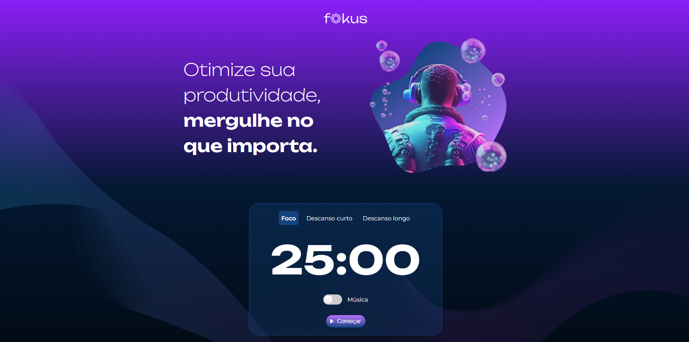

# Fokus 

Projeto "Fokus" desenvolvido durante o curso "JavaScript: manipulando elementos no DOM" da Alura.

## Screenshots

## Ferramentas utilizadas

- HTML
- CSS
- JavaScript

## Funcionalidades
- 3 tipos de timers de produtividade (Foco, Descanso curto e Descanso longo);
- Possibilidade de pausar o timer quando quiser;
- Opção de habilitar/desabilitar a música ambiente.

## Feito por:

Lucas Kenji (dinozindev).
